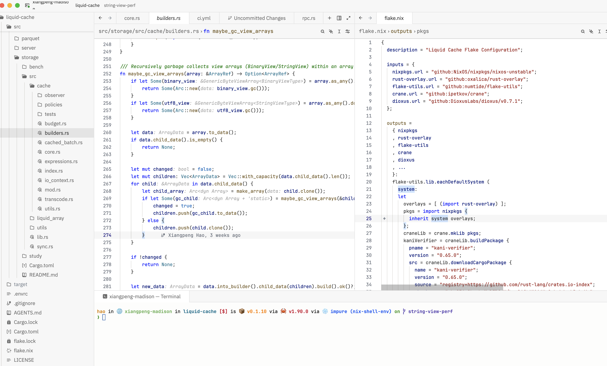

# VSCode Light Modern Theme for Zed

A faithful port of Visual Studio Code's "Light Modern" theme for the Zed editor.

## Installation

1. Open Zed
2. Use the command palette (Cmd/Ctrl+Shift+P)
3. Run `zed: install dev extension`
4. Select this repository

## Activation

1. Open Zed settings (Cmd/Ctrl+,)
2. Set your theme:
   ```json
   {
     "theme": {
       "mode": "system",
       "light": "VSCode Light Modern",
       "dark": "VSCode Light Modern"
     }
   }
   ```

Or use the command palette:

- Run `theme selector: toggle`
- Select "VSCode Light Modern"

## Screenshot



## Credits

This theme is adapted from Microsoft's [Visual Studio Code Default Themes](https://github.com/microsoft/vscode/tree/main/extensions/theme-defaults).

Original theme: [light_modern.json](https://github.com/microsoft/vscode/blob/main/extensions/theme-defaults/themes/light_modern.json)

## License

MIT License - See the original VSCode repository for license details.
